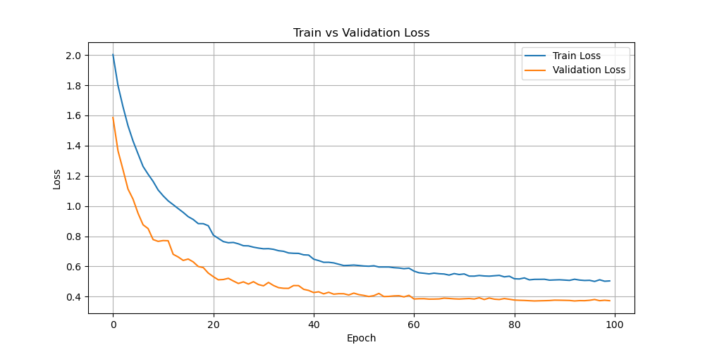
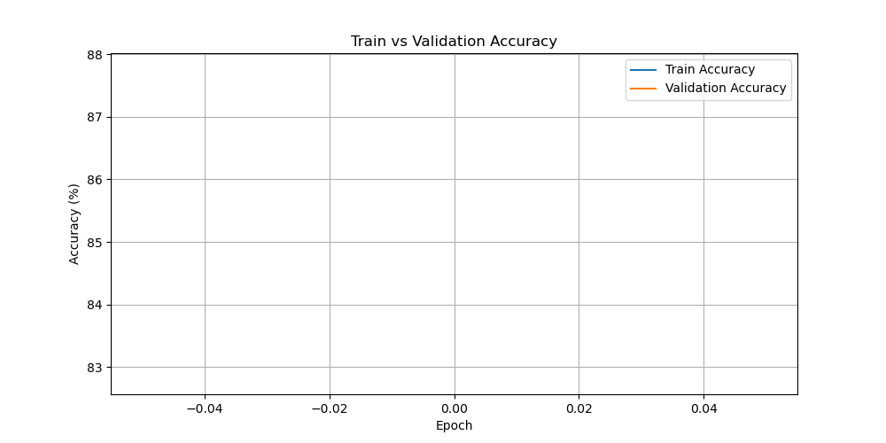
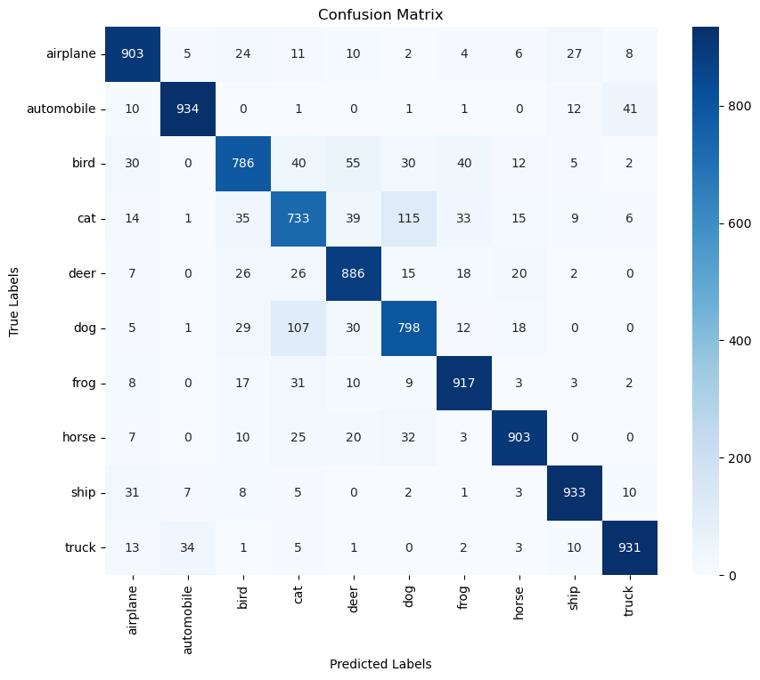

# CIFAR-10 CNN Classifier with PyTorch

A custom convolutional neural network (`MyNet`) built from scratch using PyTorch to classify images from the [CIFAR-10 dataset](https://www.cs.toronto.edu/~kriz/cifar.html). This project includes a complete training pipeline, data augmentation, model checkpointing, visualization of results, and a confusion matrix for detailed performance analysis. The model achieved **87% accuracy** on the test dataset.

---

## 📌 Features

- Custom CNN (`MyNet`) with **6 convolutional layers**, BatchNorm, and Dropout
- Stratified train/validation split using `StratifiedShuffleSplit`
- Advanced data augmentation: AutoAugment, RandomCrop, and ColorJitter
- Training loop with real-time loss and accuracy tracking
- Learning rate scheduling with `StepLR`
- Final evaluation on the test dataset
- Visualizations: training vs. validation loss, accuracy, and confusion matrix

---

## 🏗️ Model Architecture

- **Convolutional Layers**: 6 layers with increasing depth (8 → 256 channels)
- **Pooling**: MaxPooling applied after specific layers
- **Batch Normalization**: Applied to the first 5 convolutional layers
- **Activation Function**: ReLU used throughout the network
- **Classifier**: Global Average Pooling → Fully Connected (512) → Fully Connected (10)
- **Dropout**: 50% dropout before the final fully connected layer

---

## 🧪 Data Pipeline

- **Dataset**: CIFAR-10, automatically downloaded using `torchvision`
- **Splits**:
   - **Training**: 80%
   - **Validation**: 20% (stratified)
   - **Test**: Official CIFAR-10 test set
- **Augmentation**:
   - AutoAugment policy for CIFAR-10
   - Random cropping and flipping
   - Color jitter for brightness, contrast, and saturation

---

## 🚀 How to Run

1. **Install dependencies**:

    ```bash
    pip install torch torchvision matplotlib numpy scikit-learn tqdm
    ```

2. **Train the model**:

    ```bash
    python3 MyNet.py
    ```

---

## 📊 Visual Output

### 🔻 Loss Plot



### 🔺 Accuracy Plot



### 📉 Confusion Matrix



---

## 📁 Project Structure

```text
├── MyNet.py                     # Main script containing model, training, etc.
├── data/                         # CIFAR-10 dataset (auto-downloaded)
├── figures/                      # Directory for saved plots
│   ├── loss_fig.png              # Loss plot
│   ├── accuracy_fig.png          # Accuracy plot
│   └── confusion_matrix.png      # Confusion matrix
├── cifar_mynet_final.pt          # Final trained model
├── cifar_mynet_epoch_*.pt        # Model checkpoints
└── README.md                     # Project documentation
```
